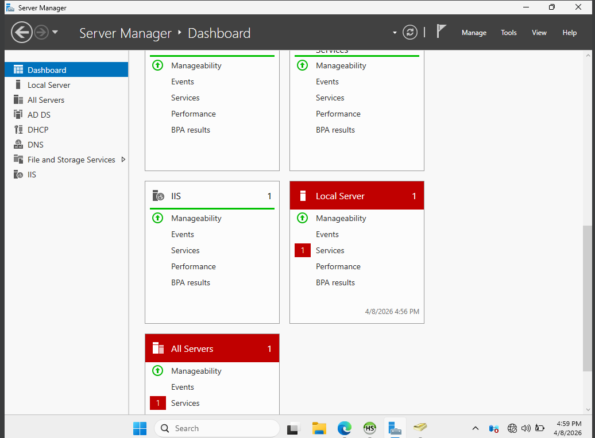
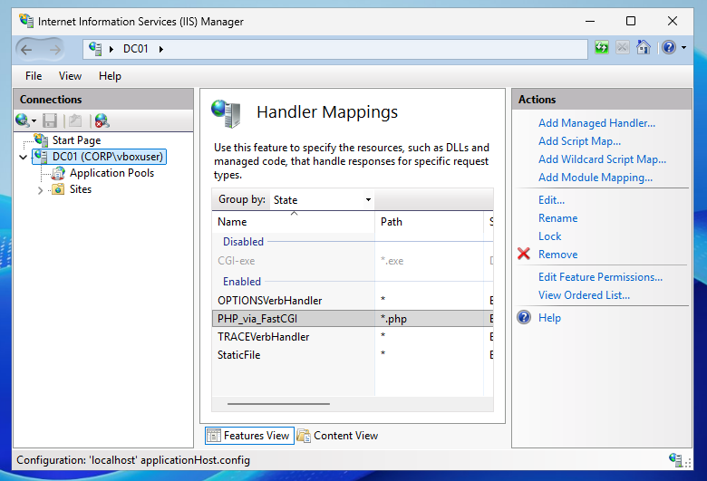
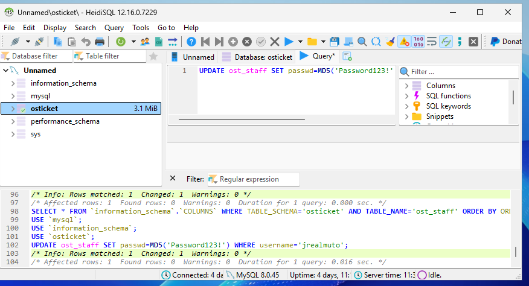
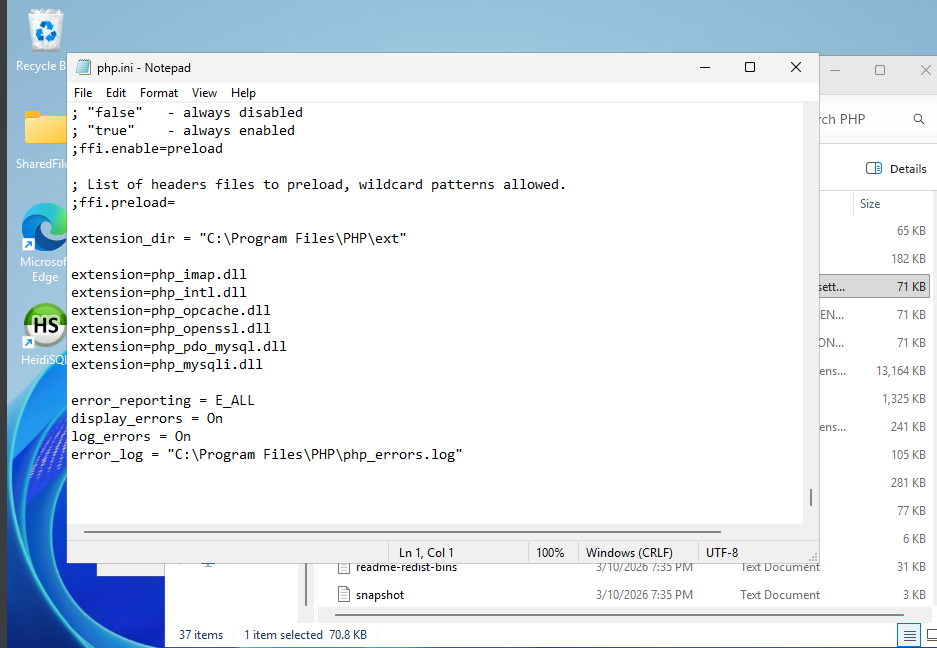
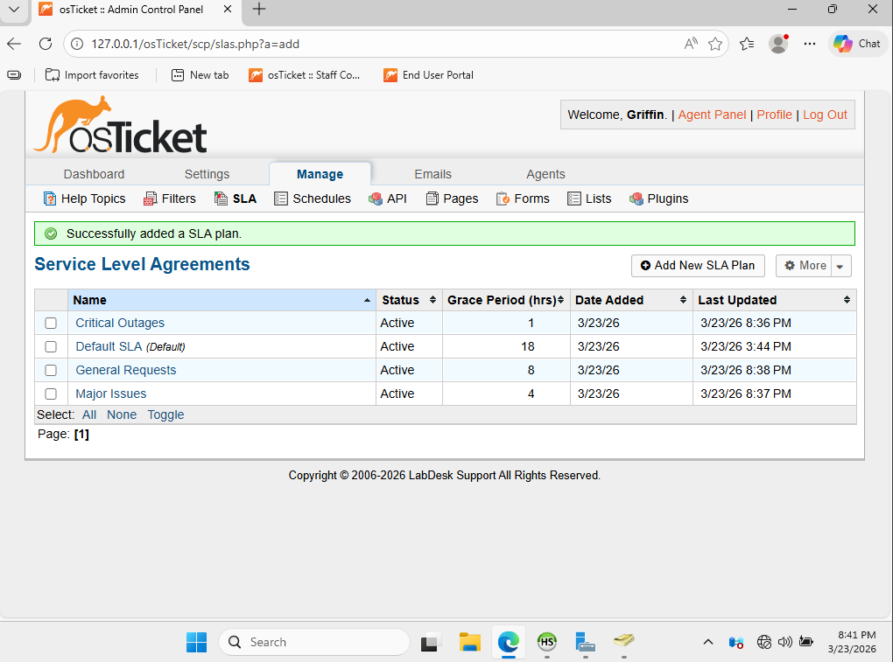

# osTicket Help Desk Lab

This project simulates a real help desk ticketing system using osTicket and HeidiSQL 

Tools: 
-Virtual box
-Windows Server 2025
-Windows 11 Pro
-ADDS, DNS, DHCP, and IIS
-PHP
-MySQL and HeidiSQL 

## Step 1: Installed IIS to setup functioning Windows Server 

### IIS in Server Manager

## Step 2: Installed PHP and registered it in IIS handler mappings 

### PHP in IIS Handler Mappings

## Step 3: Installed MySQL and HeidiSQL and created osTicket database 

### osTicket database in HeidiSQL

## Step 4: Enabled PHP extensions

### PHP.ini file extensions

## Step 5: Download and Setup osTicket

### osTicket Roles setup

## Step 6: Configured Agents, Roles, Departments, and End Users

### Agents, Departments, and End Users setup

## Step 7: Configured SLAs and Help Topics 

### Service Level Agreements and Help Topics

## Step 8: Practice Scenario: Account lockout 

